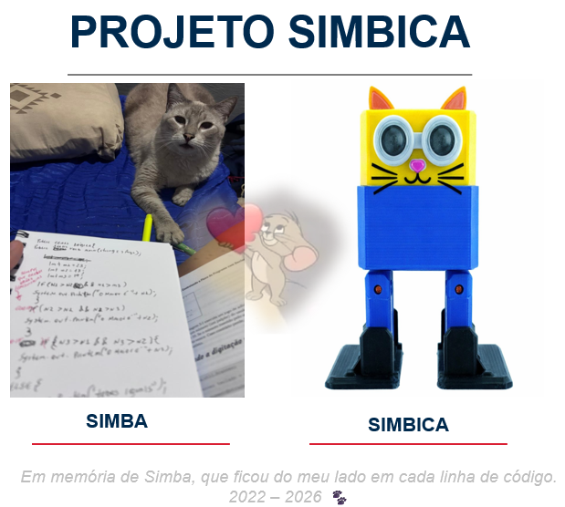

# 🤖 Simbica

Projeto de robótica criado em homenagem ao meu gato Simba. ❤️

## 📌 O que é

Simbica é um robô bípede baseado no Otto DIY, projeto open source mundial.
Ele caminha, desvia de obstáculos e emite sons — tudo programado do zero
por alguém que não sabia nada de Arduino antes desse projeto.

## 🔧 Componentes

- Microcontrolador Arduino Nano
- Shield de expansão para Nano
- 4x Micro Servo Motor 9g SG90
- Sensor Ultrassônico HC-SR04
- Buzzer Ativo 5V
- Módulo Step Down Mini 360
- Peças impressas em 3D (Otto DIY)
- Bateria 9V recarregável

## 💻 Tecnologias

- Linguagem: C/C++
- Plataforma: Arduino IDE
- Biblioteca: OttoDIYLib
- Área: Robótica, Sistemas Embarcados e Automação

## 🚀 Como rodar

1. Instale o Arduino IDE
2. Instale a biblioteca OttoDIYLib pelo Library Manager
3. Faça o upload do arquivo Simbica.ino para o Arduino Nano
4. Ligue a bateria e veja ele andar!

## 🐱 A história

Perdi meu gato Simba recentemente. Ele era meu companheiro do dia a dia.
No meio dessa saudade, surgiu a ideia de criar algo em homenagem a ele.
Nascia o projeto Simbica.

Queimei sensor, errei conexão, passei horas tentando — e no final ele andou.

A constância nos leva longe quando estamos fazendo algo que realmente nos importa.

Feito com 💙 por raquelcarvii
